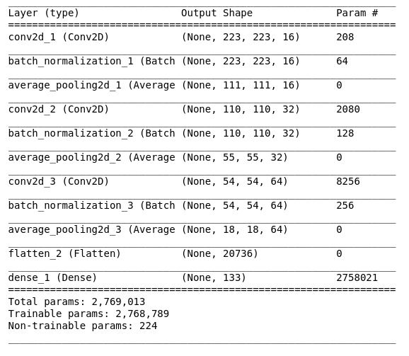

# Dog Identification project
# Udacity's Data Scientist nanodegree capstone project.

## Project Overview:
Computer vision with deep learning have advanced drastically in last few years. That all is thanks to the Convolutional Neural Networks. This helps in many fields, from autonomous vehicles to medical imaging. In this project we aim to use this technology in identifying dog breeeds from photos. All the data and pretrained models where supplied by the udacity team in the workspace.

## Problem Statement:
The goal of this project is try out different methods to classify dog breeds. We first try to build our own network then we move on onto using pretrained network weights. More to be discussed in the methodology. 

## Metrics: 
For the sake of this project we use regular accuracy as our metric. The data set lacks any mis-balance between classes so accuracy is a good fit. Also, it is a good and universally recognizable  key performance indiator. 
A naive predictor that predicts the most occuring class assuming they are all equally present would have an accuracy of 1/133 which is around 0.7%

## Data: 
The dog and human images are supplied by the udacity team in the workspace data. The data sets are split into train/test/val sets. Since the data was just images, no plots were needed for data cleaning and exploration.
Some data statistics:
* There are 133 total dog categories.
* There are 8351 total dog images.
* There are 6680 training dog images.
* There are 835 validation dog images.
* There are 836 test dog images.

## Preprocessing: 
Images were resized to have the shape of 224,224,3 to match the image sizes of the imagenet dataset as we use its pretrained models. 
Also the model automatically normalized the given images such that they have the same distribution as the imagenet images it was trained on. 

## Methodology: 
We first aim to develop a human face detector part. For this we use a cascade filter identifier with the pretrained data supplied by the staff. 
Next we create a dog detector part. For this a deep learning model was used. We use a Resnet50 model pretrained on imagenet. Imagenet already has dogs as classes in their classifier. Namely classes 151-268, so we identify is the pcture is a dog's image if the predicted class from the Resnet50 model falls within this range. 
Out of a 100 sampled dog images all of the 100 were correctly identified and none were identified as humans. As for the face detector 100% of human faces were correctly identified while only 11% for dogs which led us to then develop the aforementioned dog detector. 
Next we first try to train a model from scratch using keras. Here is the model summary:

We manage to get a slightly higher than 1% accuracy at 4.0670%. With training accuracy of around 99% which is a clear case of overfitting.
We can attribute that to the fact that our dataset is small and for deep neural networks to generalize well it needs huge number of data. That's why we move on to use pretrained models. 

### Refinement: 
We first use a VGG16 model as our bottleneck network. It was pretrained on imagenet. We then add a dense layer with a softmax activation at the end. 
We managed to push the accuracy higher up to 40.6699%. However,  we did not intend to stop there as there are other more powerful CNN models to try. 
Next we chose to try a VGG19 model also trained on imagenet. We also added another Dense layer and ending with the same softmax 133 node layer. The accuracy considerable increased to reach 73.5646%. 

In more detaile here, the Deep networks like VGG16/VGG19 here acts like feature extractors. Meaning that they take the raw image pixels and outputting a vector that carries information relevant to out problem. These features are thus easy to generalize on in the following dense layers. 

## Evaluation and Results: 
After we settled on using the VGG19 model of our breed detection we started our simple algorithm. We first check if that picture has a human face and/or a dog. If it fails to find any of them, an error is presented and the program stops. However, if it finds a human it says which breed resembles this human the most. If it is a dog it predits its breed. 
Examples can be found at the notebook [here](dog_app.html)
