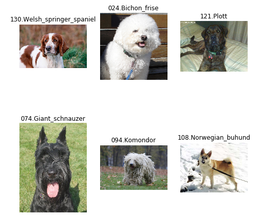
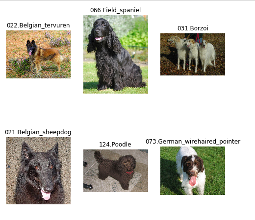
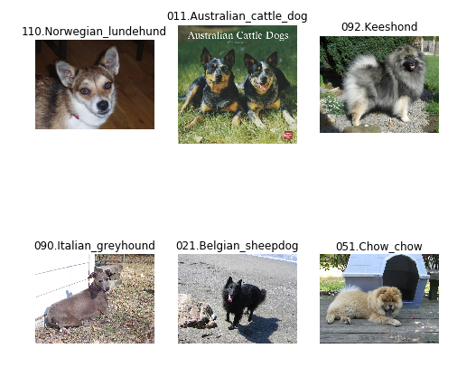
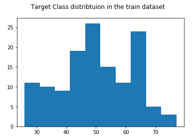
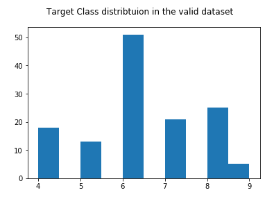
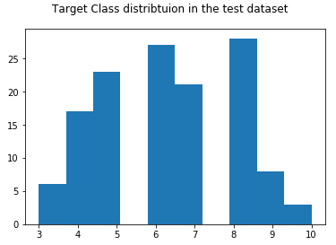
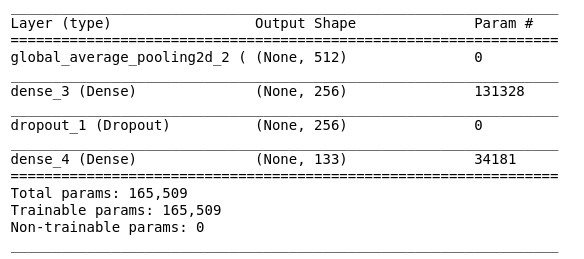
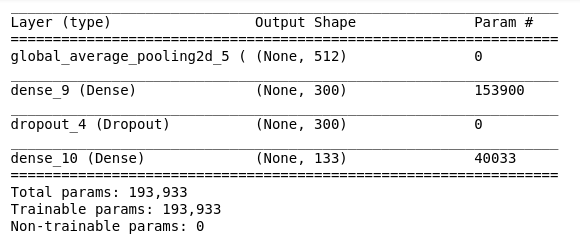
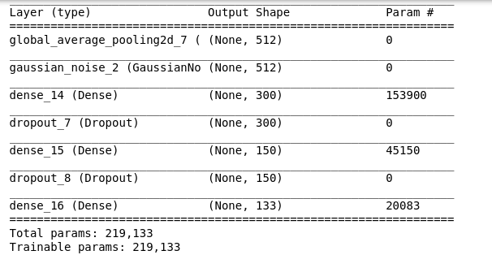
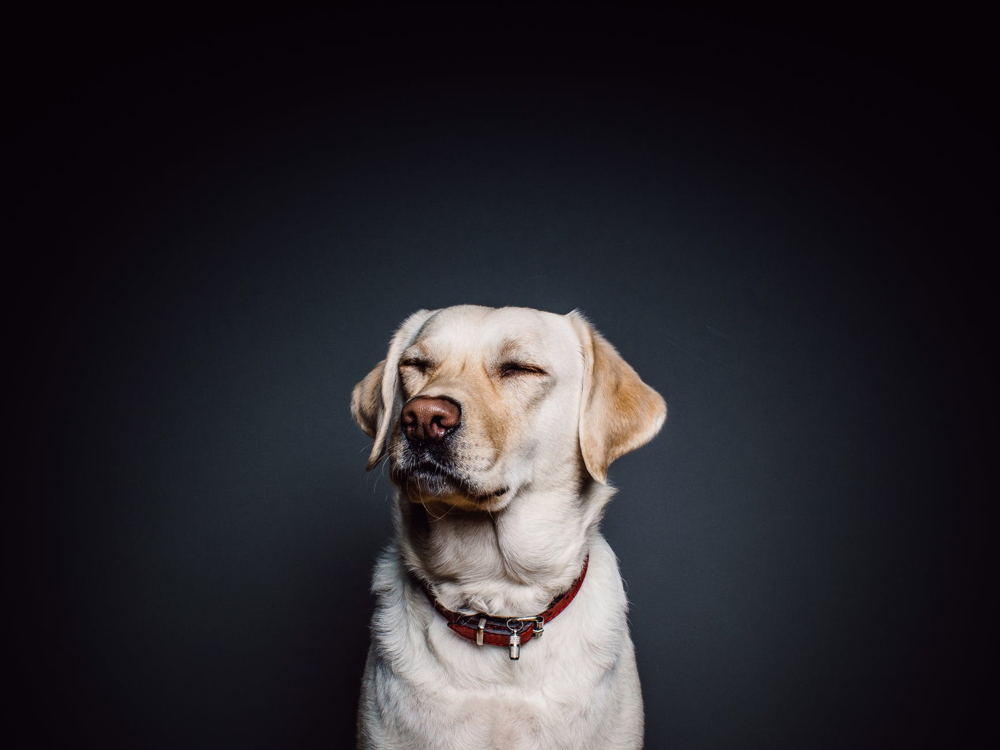

# Dog Identification project
# Udacity's Data Scientist nanodegree capstone project.

## Project Overview:
Computer vision with deep learning has advanced drastically in the last few years. That all is thanks to the Convolutional Neural Networks. This helps in many fields, from autonomous vehicles to medical imaging. In this project, we aim to use this technology in identifying dog breeds from photos. All the data and pre-trained models where supplied by the udacity team in the workspace.

## Problem Statement:
The goal of this project is to try out different methods to classify dog breeds. We first try to build our own network then we move on onto using pretrained network weights. More to be discussed in the methodology. 

## Metrics: 
For the sake of this project, we use regular accuracy as our metric. The data set lacks any misbalance between classes so accuracy is a good fit. Also, it is a good and universally recognizable key performance indicator. 
A naive predictor that predicts the most occurring class assuming they are all equally present would have an accuracy of 1/133 which is around 0.7%

## Data: 
The dog and human images are supplied by the udacity team in the workspace data. The data sets are split into train/test/val sets. Since the data was just images, no plots were needed for data cleaning and exploration.
Some data statistics:
* There are 133 total dog categories.
* There are 8351 total dog images.
* There are 6680 training dog images.
* There are 835 validation dog images.
* There are 836 test dog images.
Also, here are some samples from train, validation and test sets. Code available in notebook:

This gives us an idea about the structuring of the data. In more details, There are three folders, train, valid and test. Each of which has 133 folders for each class target. Each folder has all the images belonging to ths categories 

## Data Exploration:
After taking a look at the sample images, we find that they do not all have the same aspect ratio. Thus can have negative effects in the difference of the transformations of the data. One solution is to use center cropping instead of scaaling directly. 

Next, we take a look at the distribution of the target class labels. Here are the histograms:

We find that training data is well distrbuted. All classes has at least around 30 images with the majority around 50 and 65. We cannot say that the data is heavily misbalanced, there might be some mis-balanced but it can pass for now. 

## Preprocessing: 
Images were resized to have the shape of 224,224,3 to match the image sizes of the imagenet dataset as we use its pre-trained models. 
Also, the model automatically normalized the given images such that they have the same distribution as the imagenet images it was trained on. 

## Methodology: 
We first aim to develop a human face detector part. For this, we use a cascade filter identifier with the pretrained data supplied by the staff. 
Next, we create a dog detector part. For this, a deep learning model was used. We use a Resnet50 model pretrained on imagenet. Imagenet already has dogs as classes in their classifier. Namely classes 151-268, so we identify is the picture is a dog's image if the predicted class from the Resnet50 model falls within this range. 
Out of 100 sampled dog images all of the 100 were correctly identified and none were identified as humans. As for the face detector, 100% of human faces were correctly identified while only 11% for dogs which led us to then develop the aforementioned dog detector. 
Next, we first try to train a model from scratch using keras. Here is the model summary:

We manage to get slightly higher than 1% accuracy at 4.0670%. With training accuracy of around 99% which is a clear case of overfitting.
We can attribute that to the fact that our dataset is small and for deep neural networks to generalize well it needs a huge number of data. That's why we move on to use pretrained models. 

### Refinement: 
We first use a VGG16 model as our bottleneck network. It was pretrained on imagenet. We then add a dense layer with a softmax activation at the end. 
We managed to push the accuracy higher up to 40.6699%. However,  we did not intend to stop there as there are other more powerful CNN models to try. 
Next, we chose to try a VGG19 model also trained on imagenet. We also added another Dense layer and ending with the same softmax 133 node layer. The accuracy considerable increased to reach 73.5646%. 
The model:

In more details here, the Deep networks like VGG16/VGG19 here acts like feature extractors. Meaning that they take the raw image pixels and outputting a vector that carries information relevant to our problem. These features are thus easy to generalize on in the following dense layers. 

Afte, we reached the 73% we still feel there is some overfitting still present. The train accuracy was 93.2635%. We next choose to increase the dropout rate to 40% and make the first dense layer 300 nodes. 

The Model:

train accuracy: 96.9611%
validation accuracy: 78.0838%
Test accuracy: 75.9569%

So we thought that we can also increase it further. We thought about gaussian noise to avoid iverfitting so we added a keras Gaussian noise layer that adds noise on training. That should increase the robustness of the model and help decrease the overfitting. We also added another Dense and Dropout pair with 150 nodes to increase the models power.

The model:

train accuracy: 98.5778%
validation accuracy: 77.3653%
Test accuracy: 79.1866%

We notice a trend of increase in all the accuracies. However, the Test accuracy increase to a satisfactory result with 6% from our first VGG19 attempt. 

Reflection: dropout and gaussian noise layers really helped out the model to avoid memorizing the images because it had to know what to focus for which is really intuitive. 

## Evaluation and Results: 
After we settled on using the VGG19 model of our breed detection we started our simple algorithm. We first check if that picture has a human face and/or a dog. If it fails to find any of them, an error is presented and the program stops. However, if it finds a human it says which breed resembles this human the most. If it is a dog it predicts its breed. 
Examples can be found at the notebook [here](dog_app.html)

We will now analyze to examples:

The model predicted a labrador retriever which is a correct classification. We now see that our model was able to predict well on images from a different pool of data.

Next, we look at a human subject: 

The predicted dog that resembles that human subject is Xoloitzcuintli breed. That breed is also called Mexican Hairless Dog. This might first seem counter-intuitive as the man in the picture is pretty hairy. However, Mexican Hairless Dogs have dark coat colors that his jacket looks similar too which explans that prediction

## Justification: 

The pretrained model outperformed the from scratch model for the following reasons.
* Imagenet had millions of images which give the models room and scale of data to generalize and learn important patterns in the images.
* The architectures are from the state of the art literature in Deep Learning which was meticulously tested by researchers and were made with expert views in mind.

## Reflection and Improvements:

All in all, what we gain from this project is the importance of the scale of data. Also, when we pair Deep Learning research knowledge, with magnitude of data we can achieve really powerful models that can achieve any task thrown at it. 

For improvement we can try to: 
* We can find a bigger dataset in the order of millions to achieve a more robust model. 
* We can try another pretrained model.
* We can use data augmentation to improve the model's robustness.
